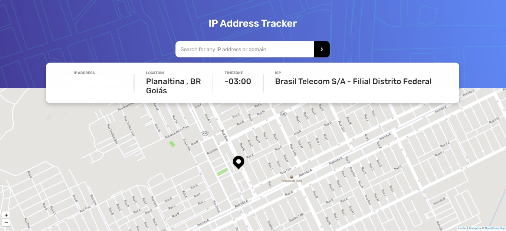
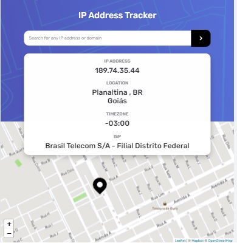
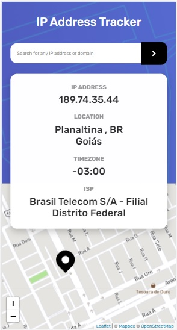

# IP Address Tracker 💜 Desafio Frontend Mentor

<p align="center">Feito com 💙 por Hugo Alves Varella</p>

&nbsp;

### 🔗 Link para o projeto online

[IP Address Tracker](https://ip-address-tracker-r7pvoz3g2-hugovarellaa.vercel.app/)

&nbsp;

<div align="center">
  
  
  
</div>

<br/>

## 📚 Informações sobre o projeto

- Esse projeto foi desenvolvido sobre um desafio da plataforma [Frontend Me](https://www.frontendmentor.io/challenges/ip-address-tracker-I8-0yYAH0/hub/ip-address-tracker-Hy3zuCaf5)

&nbsp;

## 💻 O que tem no projeto?

- Nesse Projeto utilizei uma API de geolocalização IP da IPify.
- Estilizei tudo com styled-components.
- Consumo e uso da API do github.
- Estilizei o mapa com API da mapbox.
- Utilizei react-toastify para avisos de error.
- Interface Responsiva e Dinamica.

&nbsp;
&nbsp;

## 🛠️ Tecnologias/Ferramentas ultilizadas

- [React-JS](https://pt-br.reactjs.org/E)
- [Next.JS](https://www.typescriptlang.org/)
- [styled-components](https://styled-components.com/)
- [leaflet](https://date-fns.org/)
- [react-leaflet](https://react-leaflet.js.org/)
- [react-toastify](https://www.npmjs.com/package/react-toastify)

## ⚙️ Instalação

```
# Abra um terminal e copie este repositório com o comando
$ git clone https://github.com/Hugovarellaa/ip-address-tracker
```

```
# Acesse a pasta da aplicação
$ cd ip-address-tracker

Crie um arquivo .env.local e coloque as variaveis de ambiente baseado no arquivo .env.example


# Instale as dependências
$ yarn

# Inicie a aplicação
$ yarn dev

```

---

